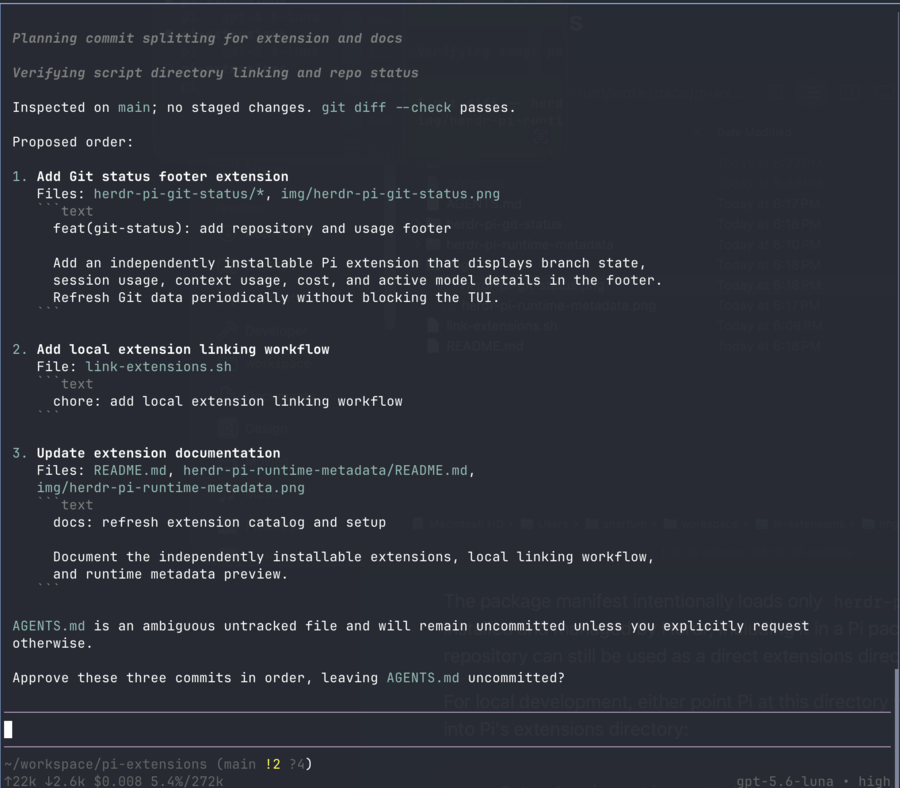
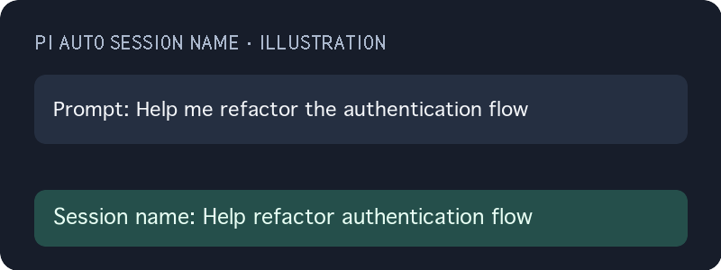

# Pi Extensions

Small, independently installable [Pi](https://github.com/Badlogic/pi-mono)
extensions for [Herdr](https://github.com/Smaths/herdr).

## Extensions

| Extension | Preview | Description |
| --- | --- | --- |
| [`herdr-pi-runtime-metadata`](herdr-pi-runtime-metadata/) |  | Reports Pi’s active model and thinking level as display-only Herdr metadata. |
| [`herdr-pi-git-status`](herdr-pi-git-status/) |  | Shows repository state, session usage, context usage, and the active model in Pi’s footer. |
| [`pi-auto-session-name`](pi-auto-session-name/) |  | Names new sessions from their first text prompt locally, with an optional hybrid model fallback. |

Each extension has its own `index.ts`, `package.json`, and concise README.
Previews are linked in the table above.

## Local development

Link all extensions into Pi’s extension directory:

```sh
./link-extensions.sh
```

Or install one package directly with `pi install --local ./<extension-directory>`
or load it temporarily with `pi -e ./<extension-directory>`.

The runtime metadata extension is active only when Herdr sets
`HERDR_ENV=1`, `HERDR_SOCKET_PATH`, and `HERDR_PANE_ID`. The agent-state
integration is managed by Herdr; do not install a duplicate copy.

Each package is versioned and published independently.
