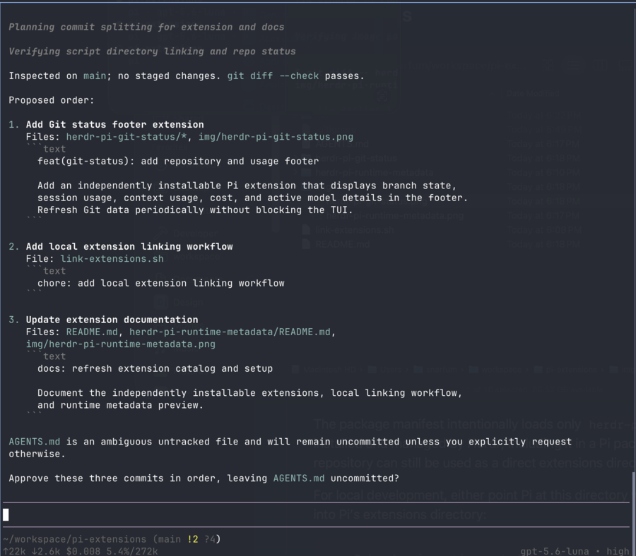
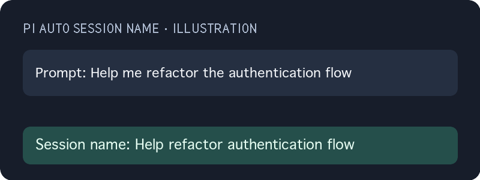
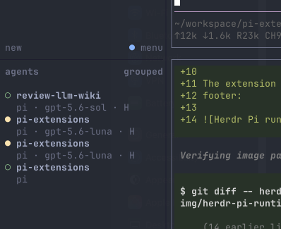

# Pi Extensions

Small, independently installable [Pi](https://github.com/Badlogic/pi-mono)
extensions, including optional integrations for [Herdr](https://github.com/Smaths/herdr).

## Extensions

| Extension | Preview | Description |
| --- | --- | --- |
| [`@snarfum/pi-git-status`](pi-git-status/) |  | Shows repository state, session usage, context usage, and the active model in Pi’s footer. This extension does not require Herdr. |
| [`@snarfum/pi-auto-session-name`](pi-auto-session-name/) |  | Names new sessions with a minimal, verb-first action title of up to three words. |
| [`@snarfum/pi-herdr-runtime-metadata`](pi-herdr-runtime-metadata/) |  | Reports Pi’s active model and thinking level as display-only Herdr metadata. |
| [`@snarfum/pi-herdr-session-name`](pi-herdr-session-name/) |  | Publishes Pi’s session name as the Herdr pane title and for an optional third Agent sidebar row. |

Each extension has its own `index.ts`, `package.json`, and concise README.
The two `pi-herdr-*` packages are the only Herdr-specific extensions.

## Installation

Install individual published packages with Pi:

```sh
pi install npm:@snarfum/pi-git-status
pi install npm:@snarfum/pi-auto-session-name
pi install npm:@snarfum/pi-herdr-runtime-metadata
pi install npm:@snarfum/pi-herdr-session-name
```

For local development, install one package from this repository with
`pi install --local ./<extension-directory>` or load it temporarily with
`pi -e ./<extension-directory>`.

## Local development

Link all extension packages into Pi’s extension directory:

```sh
./link-extensions.sh
```

The Herdr integrations are active only when Herdr sets `HERDR_ENV=1`,
`HERDR_SOCKET_PATH`, and `HERDR_PANE_ID`. Herdr manages the agent-state
integration; do not install a duplicate copy.

Each package is versioned and published independently.

## License

[MIT](LICENSE)
