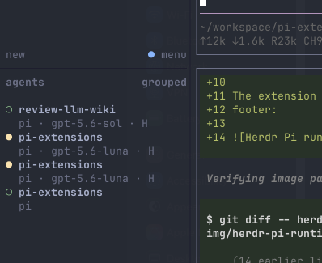

# Herdr Pi runtime metadata

Reports Pi’s active model and thinking level as display-only Herdr metadata.

This is an optional companion to Herdr’s managed agent-state integration. It is
safe to load outside Herdr and becomes active only when `HERDR_ENV`,
`HERDR_SOCKET_PATH`, and `HERDR_PANE_ID` are set.

## Runtime metadata

The extension exposes the active Pi model and thinking level in the Herdr
footer:

