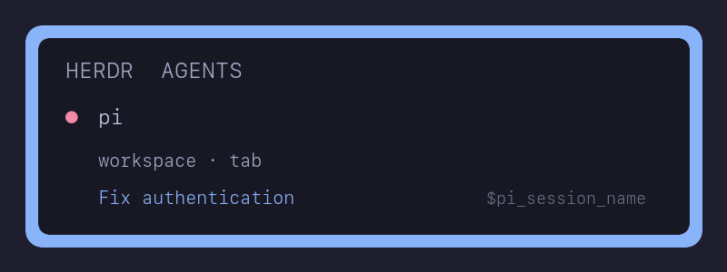

# Pi Herdr session name

Publishes Pi's current session name to Herdr as the pane title and as the
display-only `pi_session_name` token. This pairs with `pi-auto-session-name`:
when that extension names the session after its first settled run, the name
appears on the Pi pane's border. It updates on `/name` and clears on `/new` and
on exit.

The extension is opt-in and active only in a Herdr-managed TUI pane with
`HERDR_ENV`, `HERDR_SOCKET_PATH`, and `HERDR_PANE_ID` set.

Install the published package with `pi install npm:@snarfum/pi-herdr-session-name`,
or install locally with `pi install --local ./pi-herdr-session-name` from the
repository root. You can load it temporarily with `pi -e ./pi-herdr-session-name`.

The title applies only while Herdr recognizes Pi as the pane's agent. In Herdr
0.9.1, a metadata title takes precedence over a manual `herdr pane rename`
label. Set `PI_HERDR_SESSION_NAME_TITLE=0` to keep your manual label and publish
only the token.

Optionally, add the token to Herdr's Agent sidebar configuration to make it a
third row:

```toml
[ui.sidebar.agents]
rows = [
  ["state_icon", "machine", "workspace", "tab"],
  ["agent"],
  ["$pi_session_name"],
]
```

Then reload Herdr's config. The row disappears until Pi has a session name.


